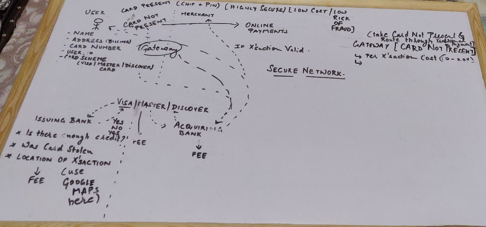
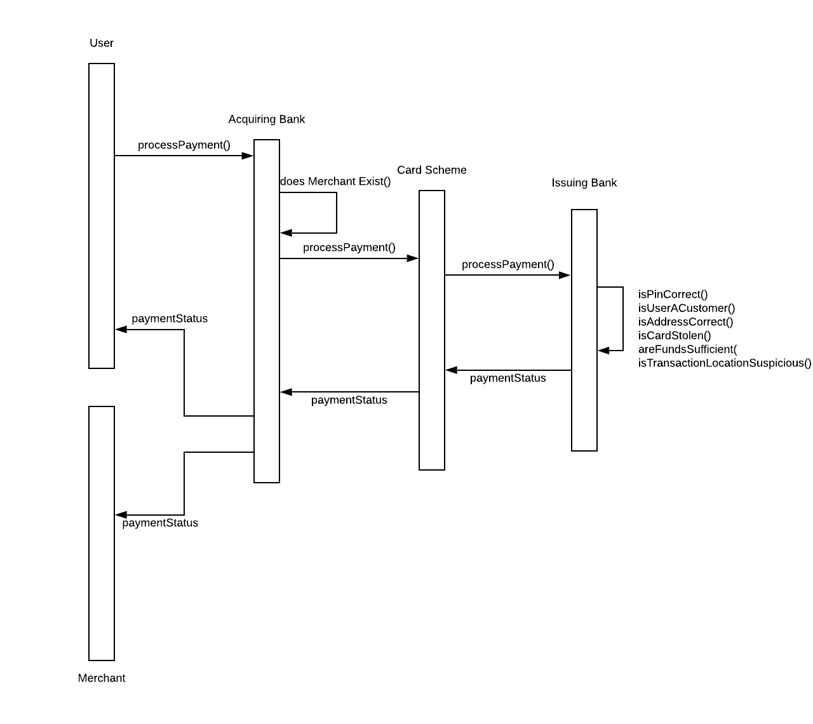
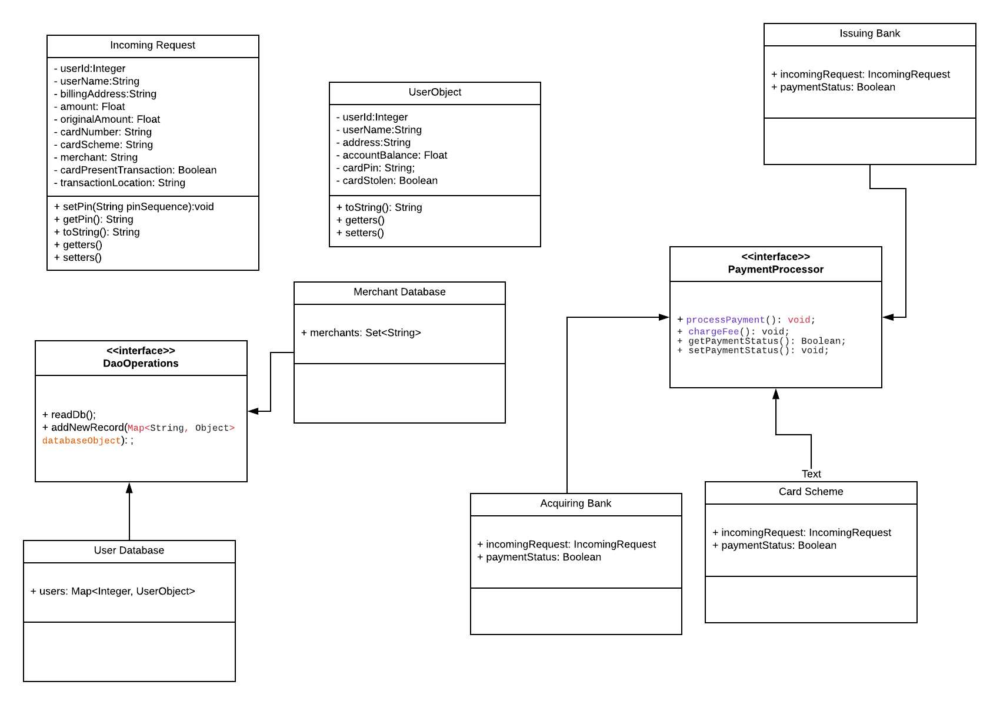

### Online Processing Payment Application
- **Author** : Vishal Seshagiri

#### Implementation Story
- Online Payment Systems is something I was completely oblivious of before this project and researching through scores of sources of information eventually got me this [video](https://youtu.be/ZciY1No5-Rw).
- The rough system design whiteboard after grasping the contents looked something like this `:dizzy_face:`

- Here's a run down of the steps performed by this application:
    - The User initiates a request by passing in their name, address, amount, type of transaction, card scheme (Visa, Mastercard, Discover) etc.
    - The request is passed to the acquiring bank which holds the merchant's account. The acquiring bank checks if the merchant exists and then passes the request to the Card Scheme.
    - The Card Scheme is considered a blackbox for the purpose of this project and merely routes the data to the Issuing bank which holds the user's accounts.
    - The Issuing bank then runs a series of checks on the user. On verification that the transaction is feasible a success acknowledgement is backpropagated through the network to the user and the merchant. A service fee is charged at each of the payment processors.
    - The **isCardPresent** boolean is a very domain specific information for Online Payment Systems. It has nothing to do with the presence or absence of the card. If **isCardIsPresent** is **true** in the Payments world it is a chip and pin transaction while if it is **false** it indicates an online transaction like ones we do at ecommerce websites where we basically enter card information and that's that.

#### UML Sequence Diagram

#### UML Class Diagram

#### Goal
- My code is broken down into 4 main directories
    - Data Access Object files which basically consist of **UserDatabase.java** and **MerchantDatabase.java**
    - Payment Procedure Data Transfer Operations which are **IncomingRequest.java** and **UserObject.java**.
    - Payment Processor files which are **AcquiringBank.java**, **CardScheme.java** and **IssuingBank.java**.
    - Payment Runner file which is **PaymentApplication.java**.
- I have used the **Protoype Design Pattern** for this project which is evident from the ample usage of interfaces and objects.
- There aare two basic interfaces in the project which are **DaoOperations** and **PayProcessor**
- Whenever possible class variables have been limited to private access modifiers to ensure **security** in the application and getters and setters are used to facilitate **accessibilty**.
- Custom **Exceptions** are thrown to **validate** the data and caught in the application runner. A static final class **ErrorHandler.java** has been created to store the exception enumerations.
- **Console based logging** has been achieved using the log42j library.

#### Improvements
- As a part of further improvements geospatial features of the transaction can be tracked to ensure prevention of fraudalent transactions. This can done by using the goolemaps java api and querying the distance between transaction location and user's billing address. A simple heuristic can then be employed to either validate or invalidate the transaction.
- UserIDs could be generated randomly and passwords can be hashed using a hash function like md5 before storing to the database.
- Concurrency can be ensured by making the class methods **synchronized** and spawning threads to pass multiple incomingRequests to the api. This will ensure that the methods are thread safe and concurrent in their execution.

#### Testing
- 9 test cases have been implemented to ensure correctness of code.
- They simulate the following conditions:
    - Successful isCardPresent Transaction
    - Successful isCardNotPresent Transaction
    - Condition where **CustomerDoesNotExist** Exception is thrown
    - Condition where **CardNotPresent** Exception is thrown
    - Condition where **IncorrectPin** Exception is thrown
    - Condition where **AddressMismatch** Exception is thrown
    - Condition where **StolenCard** Exception is thrown
    - Condition where **InsufficientFunds** Exception is thrown
- The exceptions listed above are in a **logical ordered hierarchy**.

#### Acknowledgements:
- **Glassdoor** - for boilerplate code.
- **[Dennis Jones](https://www.linkedin.com/in/dennisjones2/)** - for the awesome YouTube video.